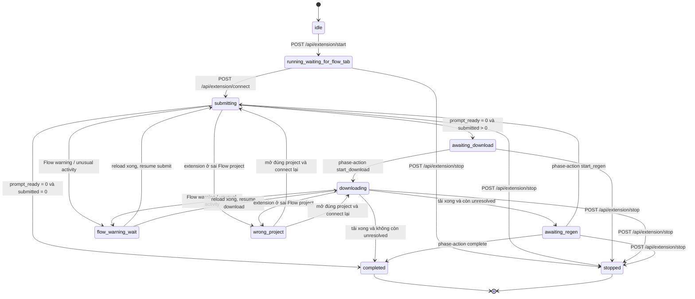
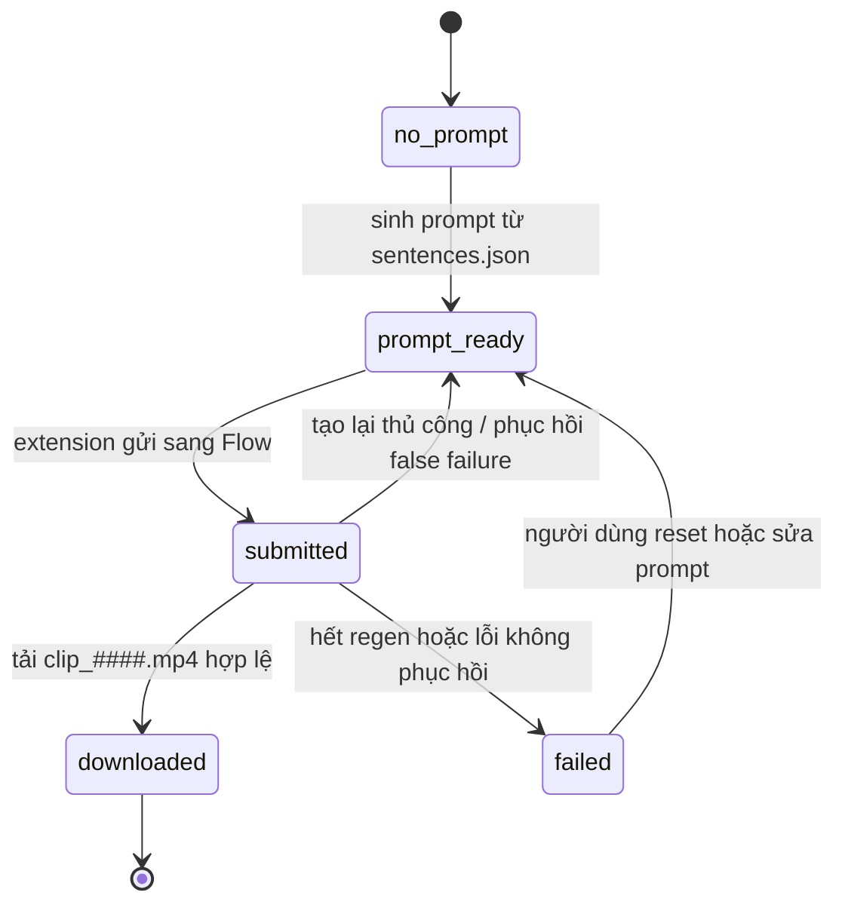

# Flow Veo Studio

Flow Veo Studio là công cụ Windows chạy cục bộ để chuẩn bị prompt Veo, điều phối Google Flow qua browser extension, tải video về đúng thư mục dự án và theo dõi trạng thái từng prompt.

Ứng dụng có hai cách mở giao diện:

- `run-desktop.bat`: mở app trong cửa sổ desktop bằng PyWebView.
- `run.bat`: chạy server và mở giao diện web tại `http://127.0.0.1:8765`.

Google Flow vẫn cần mở trong trình duyệt thật, nơi đã cài extension `Flow Veo Studio Bridge`.

## Chạy Nhanh

Ưu tiên dùng desktop GUI:

```text
run-desktop.bat
```

Hoặc dùng giao diện web:

```text
run.bat
```

Thư viện nội dung mặc định:

```text
D:\MyChannelsIRL
```

Luồng thao tác chính:

1. Chọn kênh nội dung.
2. Chọn series, app sẽ tự trỏ tới thư mục `<channel>\<series>\frames`.
3. Soạn, tải hoặc lưu kịch bản ngay trong giao diện.
4. Bấm `Kiểm tra kịch bản`.
5. Bấm `Tạo tất cả prompt` khi muốn sinh prompt.
6. Chọn provider tạo video. Hiện Google Flow là provider hoạt động chính; Sora, Runway và Pika đang là lựa chọn chờ tích hợp.
7. Dán và lưu URL project Google Flow.
8. Mở project đó trong trình duyệt đã cài extension.
9. Bấm `Tạo qua extension`.
10. Khi app báo sẵn sàng tải, bấm `Bắt đầu tải`.
11. Nếu còn prompt chưa tải xong, chọn `Tạo lại N` hoặc `Hoàn tất`.

Trước khi khởi động visual mode, luôn kiểm tra không có worker khác đang chạy:

```text
GET /api/flow/visual/status
GET /api/extension/status
```

## Giao Diện Desktop

`desktop.py` dùng PyWebView để bọc giao diện web hiện có thành app desktop. Khi chạy `run-desktop.bat`, launcher sẽ:

1. kiểm tra server tại `http://127.0.0.1:8765/api/health`;
2. nếu server chưa chạy, khởi động server nội bộ trong background thread;
3. mở cửa sổ desktop trỏ tới `http://127.0.0.1:8765`;
4. tắt server nội bộ khi đóng cửa sổ desktop.

Nếu đã có server chạy sẵn, desktop app sẽ dùng lại server đó.

## Luồng Làm Việc GUI

Người dùng không cần mở `sentences.json` thủ công trong editor ngoài. Giao diện hiện có vùng kịch bản:

- `Tải kịch bản`: đọc `sentences.json` từ thư mục `frames`.
- `Lưu kịch bản`: ghi lại `sentences.json` từ nội dung textarea.
- Mỗi dòng không rỗng trong textarea trở thành một item kịch bản.
- Khi lưu, file cũ được backup vào `_flow_veo_studio\sentences.before_gui_save_*.json`.

Các tuỳ chọn nâng cao được đặt trong khối thu gọn để giao diện chính tập trung vào 3 bước:

1. chọn nội dung;
2. chuẩn bị prompt;
3. tạo video.

## Thư Mục Và Dữ Liệu

Thư mục làm việc của một project luôn là:

```text
<frames>
```

Ví dụ:

```text
D:\MyChannelsIRL\erifan\18\frames
```

Các file chính trong `<frames>`:

```text
sentences.json
veo_prompts.json
clip_0000.mp4
clip_0001.mp4
_flow_veo_studio\
```

Ý nghĩa:

- `sentences.json`: kịch bản nguồn, gồm các đoạn text có `index`.
- `veo_prompts.json`: hàng đợi prompt và trạng thái xử lý.
- `clip_####.mp4`: video cuối cùng tải từ Flow, nằm trực tiếp trong `frames`.
- `_flow_veo_studio\downloads`: file tải thô, file lỗi hoặc file tạm.
- `_flow_veo_studio\duplicate_downloads`: video trùng SHA256 bị loại.
- `_flow_veo_studio\sentences.before_gui_save_*.json`: backup kịch bản trước khi lưu từ GUI.
- `_flow_veo_studio\veo_prompts.before_*.json`: backup hàng đợi prompt.
- `_flow_veo_studio\visual_job_status.json`: trạng thái worker legacy nếu còn tồn tại.
- `_flow_veo_studio\visual_job_stop.flag`: cờ yêu cầu dừng worker legacy.

Video cuối cùng phải nằm trực tiếp trong `<frames>`, không đưa vào thư mục con.

## Định Dạng `veo_prompts.json`

Ví dụ một item:

```json
{
  "index": 0,
  "source_text": "...",
  "title_slug": "seasoned_gardener_reflects_in_summer_plot",
  "flow_title": "000_seasoned_gardener_reflects_in_summer_plot",
  "veo_prompt": "#000, extreme close-up ... no music, no dialogue, no voiceover.",
  "status": "downloaded",
  "attempts": 1,
  "downloaded_path": "D:\\MyChannelsIRL\\erifan\\18\\frames\\clip_0000.mp4"
}
```

Marker `#000` trong `veo_prompt` là bắt buộc. Google Flow có thể sắp xếp lại card, nên `index` cục bộ vẫn là nguồn sự thật.

Trạng thái prompt:

- `prompt_ready`: prompt đã sẵn sàng gửi sang Flow.
- `submitted`: prompt đã gửi sang Flow và đang chờ tạo hoặc tải video.
- `downloaded`: video cuối cùng đã có trên ổ đĩa.
- `failed`: hết lượt retry hoặc lỗi không tự phục hồi được.

## State Machine

### Extension Mode



### Prompt Queue



## Browser Extension

Extension nằm tại:

```text
browser_extension
```

Cách cài trong Yandex Browser hoặc trình duyệt Chromium tương thích:

1. Mở trang extension của trình duyệt.
2. Bật developer mode.
3. Chọn load unpacked extension.
4. Chọn thư mục `browser_extension`.
5. Sau mỗi lần sửa code extension, reload extension card và refresh tab Flow bằng `Ctrl+R`.

Extension mode hiện là đường chính để tạo video:

- app local giữ queue trong `veo_prompts.json`;
- extension gửi prompt vào composer dưới cùng của Google Flow;
- extension tải media bằng quyền đăng nhập của trình duyệt;
- server lưu file về `<frames>\clip_####.mp4`;
- server kiểm tra SHA256 để loại video trùng;
- extension không archive hoặc xoá card Flow trong luồng hiện tại;
- khi Flow hiện warning như unusual activity, extension reload trang, chờ 10 giây rồi resume.

Không dùng lại logic cũ kiểu "nút download thứ N ứng với media thứ N". Flow DOM có thể đổi thứ tự. Extension phải tìm media trong card gần nhất có đúng một marker `#NNN`.

## Provider Video

Giao diện đã có selector provider:

- Google Flow: đang hoạt động qua browser extension.
- Sora: placeholder, chưa có adapter.
- Runway: placeholder, chưa có adapter.
- Pika: placeholder, chưa có adapter.

Khi thêm provider mới, nên giữ hợp đồng dữ liệu hiện tại:

- input chính là `veo_prompts.json`;
- trạng thái prompt vẫn dùng `prompt_ready`, `submitted`, `downloaded`, `failed`;
- output cuối cùng vẫn là `<frames>\clip_####.mp4`;
- service files vẫn đặt trong `<frames>\_flow_veo_studio`.

## API Chính

Health và thư viện:

```text
GET /api/health
GET /api/channels
GET /api/library
GET /api/flow/status
```

Project và prompt:

```text
POST /api/sentences/preview
POST /api/sentences/load
POST /api/sentences/save
POST /api/project/status
POST /api/prompts/generate
POST /api/channel/save
```

Queue:

```text
POST /api/flow/queue
```

Extension:

```text
GET  /api/extension/status
GET  /api/extension/unresolved
POST /api/extension/start
POST /api/extension/stop
POST /api/extension/connect
POST /api/extension/next-prompt
POST /api/extension/phase-action
POST /api/extension/audio-cue/ack
POST /api/extension/report-phase-done
POST /api/extension/mark-submitted
POST /api/extension/download-media
POST /api/extension/flow-error
```

Worker legacy chỉ để kiểm tra hoặc dừng trạng thái cũ:

```text
GET  /api/flow/visual/status
POST /api/flow/visual/stop
```

Các endpoint Chrome/CDP cũ đã retired và trả `410 Gone`:

```text
POST /api/flow/open
POST /api/flow/current-url
POST /api/flow/submit-batch
POST /api/flow/scan
POST /api/flow/download-visible
POST /api/flow/download-all
POST /api/flow/visual/start
```

## File Quan Trọng

- `app.py`: HTTP API, scan thư viện, queue, sinh prompt, điều phối extension.
- `desktop.py`: launcher PyWebView.
- `run-desktop.bat`: mở desktop GUI.
- `run.bat`: chạy server và web UI.
- `web\index.html`, `web\app.js`, `web\styles.css`: giao diện người dùng.
- `browser_extension\manifest.json`, `content.js`, `background.js`, `popup.html`, `popup.js`: bridge với Google Flow.
- `channels\*.json`: style theo kênh, không hardcode trong Python.
- `src\flow_automation.py`: Playwright/CDP legacy, giữ để tham khảo, không dùng làm luồng chính.

## Kiểm Tra Kỹ Thuật

```powershell
python -m py_compile app.py desktop.py src\flow_automation.py
node --check web\app.js
node --check browser_extension\content.js
node --check browser_extension\popup.js
```

OpenAI API key phải nằm trong Windows environment variable:

```text
OPENAI_API_KEY
```

Không commit API key vào repository.

## Ghi Chú Phát Triển

- Style riêng của kênh phải nằm trong `channels\*.json`.
- `GET /api/library` phải tiếp tục tự phát hiện channel mới trong `D:\MyChannelsIRL`.
- Khi chọn series, project path vẫn là thư mục `frames`, không phải đường dẫn trực tiếp tới `sentences.json`.
- Không khôi phục Chrome/CDP visual path làm luồng chính.
- Nếu sửa extension, cần reload extension trong trình duyệt và refresh Flow tab.
- Các chuỗi tiếng Nga hoặc tiếng Anh còn lại trong code thường là selector/detection text của Google Flow, không nên dịch nếu chúng dùng để nhận diện UI ngoài.
